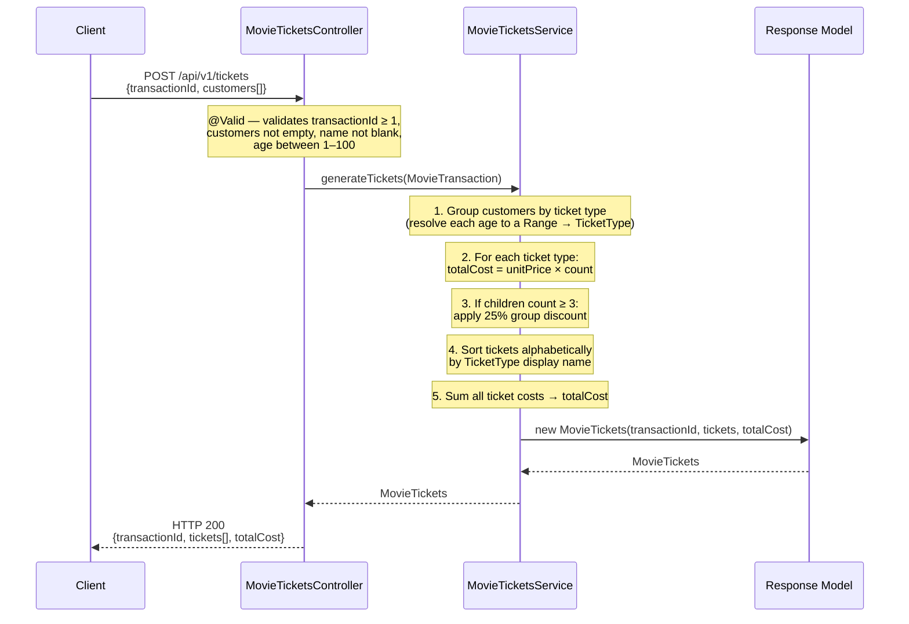
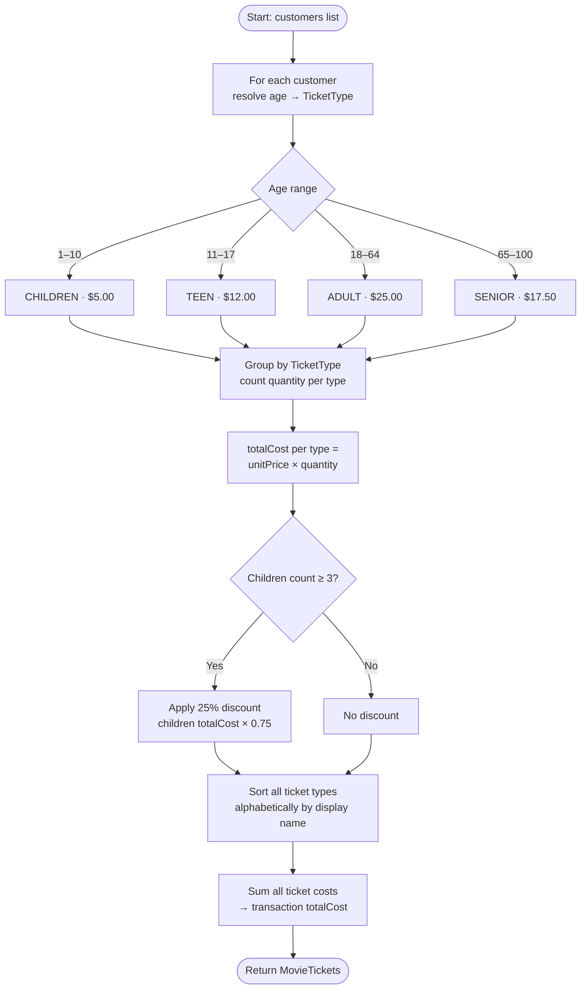

# Movie Tickets API

A REST API that calculates movie ticket pricing from customer transaction data.

## Prerequisites

- Java 25+ (tested with **Eclipse Temurin 25.0.2**)

If you use [sdkman](https://sdkman.io/), you can install and activate the required JDK with:

```bash
sdk install java 25.0.2-tem
sdk use java 25.0.2-tem
```

## Running Locally

```bash
./gradlew bootRun
```

The application starts on `http://localhost:8080`.

## Running Tests

```bash
./gradlew test
```

## API Documentation

Swagger UI is available at `http://localhost:8080/swagger-ui/index.html` when the application is running locally. It provides an interactive interface to explore and test the API endpoint.

The raw OpenAPI spec is available at `http://localhost:8080/v3/api-docs`.

## Design

### Ticket Types
Customers are assigned a ticket type based on their age:

| Ticket Type | Age Range | Price (AUD) |
|-------------|-----------|-------------|
| Children    | 1–10      | $5.00       |
| Teen        | 11–17     | $12.00      |
| Adult       | 18–64     | $25.00      |
| Senior      | 65–100    | $17.50      |

Senior tickets are priced at 30% less than Adult tickets.

### Children's Group Discount
If a transaction contains 3 or more Children's tickets, a 25% discount is applied to the total cost of all Children's tickets in that transaction. Other ticket types are unaffected.

### Response Ordering
Ticket types in the response are always ordered alphabetically: Adult, Children, Senior, Teen.

### Monetary Values
All monetary amounts are returned as an object with `amount` and `currency` fields:
```json
{ "amount": "25.00", "currency": "AUD" }
```

## API Endpoints

### Calculate ticket pricing for a transaction
```
POST /api/v1/tickets
Content-Type: application/json

{
  "transactionId": 1,
  "customers": [
    { "name": "John Smith", "age": 36 },
    { "name": "Jane Smith", "age": 8 }
  ]
}
```
**Response:**
```json
{
  "transactionId": 1,
  "tickets": [
    { "ticketType": "Adult", "quantity": 1, "totalCost": { "amount": "25.00", "currency": "AUD" } },
    { "ticketType": "Children", "quantity": 1, "totalCost": { "amount": "5.00", "currency": "AUD" } }
  ],
  "totalCost": { "amount": "30.00", "currency": "AUD" }
}
```

## curl Examples

### Single adult and child (no discount)
```bash
curl -v http://localhost:8080/api/v1/tickets \
  -H "Content-Type: application/json" \
  -d '{
    "transactionId": 1,
    "customers": [
      { "name": "John Smith", "age": 36 },
      { "name": "Jane Smith", "age": 8 }
    ]
  }'
```
```
> POST /api/v1/tickets HTTP/1.1
> Host: localhost:8080
> Content-Type: application/json
>
< HTTP/1.1 200
< Content-Type: application/json
<
{"transactionId":1,"tickets":[{"ticketType":"Adult","quantity":1,"totalCost":{"amount":"25.00","currency":"AUD"}},{"ticketType":"Children","quantity":1,"totalCost":{"amount":"5.00","currency":"AUD"}}],"totalCost":{"amount":"30.00","currency":"AUD"}}
```

### Three children (25% group discount applied)
```bash
curl -v http://localhost:8080/api/v1/tickets \
  -H "Content-Type: application/json" \
  -d '{
    "transactionId": 2,
    "customers": [
      { "name": "Billy Kidd", "age": 36 },
      { "name": "Zoe Daniels", "age": 3 },
      { "name": "George White", "age": 8 },
      { "name": "Tommy Anderson", "age": 9 },
      { "name": "Joe Smith", "age": 17 }
    ]
  }'
```
```
> POST /api/v1/tickets HTTP/1.1
> Host: localhost:8080
> Content-Type: application/json
>
< HTTP/1.1 200
< Content-Type: application/json
<
{"transactionId":2,"tickets":[{"ticketType":"Adult","quantity":1,"totalCost":{"amount":"25.00","currency":"AUD"}},{"ticketType":"Children","quantity":3,"totalCost":{"amount":"11.25","currency":"AUD"}},{"ticketType":"Teen","quantity":1,"totalCost":{"amount":"12.00","currency":"AUD"}}],"totalCost":{"amount":"48.25","currency":"AUD"}}
```

## Error Responses

| Status | Reason |
|--------|--------|
| `400 Bad Request` | `transactionId` less than 1, empty customer list, blank customer name, or customer age outside 1–100 |

---

## Architecture

### Layered Structure

The application follows a standard layered architecture with strict separation of concerns. Each layer has a single responsibility and dependencies flow strictly downward.

```
┌─────────────────────────────────────────────────────┐
│                    HTTP Client                       │
└─────────────────────┬───────────────────────────────┘
                      │ POST /api/v1/tickets
┌─────────────────────▼───────────────────────────────┐
│              Controller Layer                        │
│         MovieTicketsController                       │
│  • Accepts and validates the incoming request        │
│  • Delegates to the service layer                    │
│  • Returns HTTP 200 with the response body           │
└─────────────────────┬───────────────────────────────┘
                      │
┌─────────────────────▼───────────────────────────────┐
│               Service Layer                          │
│           MovieTicketsService                        │
│  • Resolves each customer's age to a ticket type     │
│  • Calculates costs and applies discounts            │
│  • Builds and returns the MovieTickets response      │
└─────────────────────┬───────────────────────────────┘
                      │
┌─────────────────────▼───────────────────────────────┐
│               Model Layer                            │
│   request/MovieTransaction  request/Customer         │
│   response/MovieTickets     response/MovieTicket     │
│   response/TicketType       service/Range            │
│   service/TicketTypeSummary                          │
└─────────────────────────────────────────────────────┘
```

### Package Layout

```
au.com.sportsbet.movietickets
├── MovieTicketsApplication.java       Spring Boot entry point
├── controller/
│   └── MovieTicketsController.java    REST endpoint
├── service/
│   ├── MovieTicketsService.java       Core business logic
│   ├── Range.java                     Inclusive integer range (age banding)
│   └── TicketTypeSummary.java         Internal processing record
├── model/
│   ├── request/
│   │   ├── MovieTransaction.java      Inbound request DTO
│   │   └── Customer.java             Individual customer record
│   └── response/
│       ├── MovieTickets.java          Outbound response DTO
│       ├── MovieTicket.java           Per-type ticket summary
│       └── TicketType.java            Enum: ADULT, CHILDREN, SENIOR, TEEN
├── config/
│   ├── JacksonConfig.java             MonetaryAmount serialization
│   ├── MovieTicketsProperties.java    Externalized pricing configuration
│   └── MonetaryAmountModelConverter.java  OpenAPI schema for MonetaryAmount
└── exception/
    └── GlobalExceptionHandler.java    Centralised error handling
```

### Request Processing Flow



### Pricing and Discount Logic



### Implementation Notes

**Java Records throughout** — all DTOs and internal data holders (`MovieTransaction`, `Customer`, `MovieTickets`, `MovieTicket`, `Range`, `TicketTypeSummary`) are Java records. This enforces immutability, eliminates boilerplate, and makes the data flow explicit.

**Monetary precision** — prices are handled using the [Java Money (JSR 354)](https://javamoney.github.io/) `MonetaryAmount` type via the Moneta implementation. This avoids floating-point rounding errors and keeps currency information attached to every amount.

**Custom Jackson serialization** — `MonetaryAmount` is not a standard Jackson type. `JacksonConfig` registers a custom serializer and deserializer that represent monetary values as `{"amount": "25.00", "currency": "AUD"}`, using `BigDecimal` string representation to preserve precision.

**Externalized pricing configuration** — ticket prices, age band boundaries, and discount rules are defined in `application.yml` and bound to `MovieTicketsProperties` via `@ConfigurationProperties`. This means pricing can be adjusted per environment or jurisdiction without any code changes.

**Age banding via `Range`** — ticket type resolution is driven by a `LinkedHashMap<Range, TicketType>` built from the configured age ranges and iterated in insertion order. Each `Range` record encapsulates an inclusive min/max check. Adding a new age band or changing boundaries requires only a configuration change.

**Centralised error handling** — `GlobalExceptionHandler` extends Spring's `ResponseEntityExceptionHandler` and returns [RFC 7807 Problem Details](https://www.rfc-editor.org/rfc/rfc7807) responses. Validation errors surface field-level messages in the response body; all other exceptions return a generic 500 without leaking internal details.

**OpenAPI documentation** — springdoc auto-generates the OpenAPI spec from the controller and model annotations. A custom `MonetaryAmountModelConverter` is registered at highest precedence to provide the schema for `MonetaryAmount`, since its underlying JSR 354 factory interface has overloaded setters that confuse springdoc's introspection.
